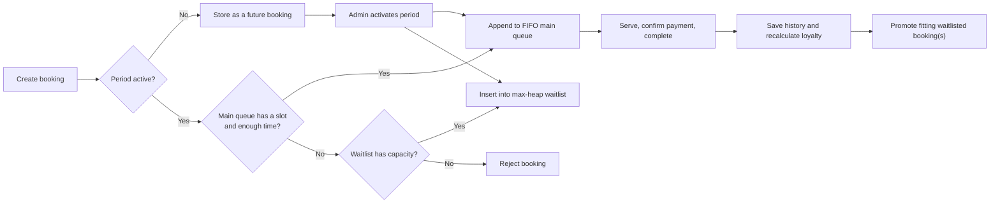

# AutoWash Priority Booking Engine


AutoWash Priority Booking Engine is a Java command-line application that models car-wash booking operations under limited service capacity. It combines FIFO service processing with membership-based waitlist priority, persistent file storage, loyalty recalculation, and one-step operational rollback.

Built for the CSD201 Data Structures and Algorithms course, the application deliberately implements its core in-memory data structures instead of relying on Java collection classes or a database.

## Contents

- [Highlights](#highlights)
- [How It Works](#how-it-works)
- [Core Data Structures](#core-data-structures)
- [Business Rules](#business-rules)
- [Technology and Architecture](#technology-and-architecture)
- [Project Structure](#project-structure)
- [Getting Started](#getting-started)
- [Using the Application](#using-the-application)
- [Data Persistence](#data-persistence)
- [Benchmark](#benchmark)
- [Documentation](#documentation)
- [Limitations](#limitations)
- [Contributing](#contributing)
- [Team](#team)
- [License](#license)

## Highlights

- Customer, vehicle, and wash-package management with validation and generated IDs.
- Booking creation for the current or a future service period, with booking-window, capacity, and service-duration checks.
- A FIFO main queue for guaranteed service slots and a max-heap priority waitlist for overflow bookings.
- Priority ordering by membership tier, then booking creation time.
- Service-period activation, payment confirmation, completion, cancellation, waitlist promotion, history reporting, and undo of the latest completion.
- Automatic loyalty recalculation from eligible completed bookings in the rolling 365-day period.
- Pipe-delimited text-file persistence with automatic sample-data seeding when storage is empty.

## How It Works



The application separates two operational ordering policies:

- The **main queue** serves accepted bookings in first-in, first-out order.
- The **waitlist** selects the highest membership tier first. For equal tiers, the earlier booking has priority.

## Core Data Structures

| Structure | Implementation | Purpose | Key operations |
| --- | --- | --- | --- |
| Linked list | `MyLinkedList<T>` | Stores customers, vehicles, packages, bookings, periods, and history. | Sequential traversal and CRUD |
| Queue | `MyQueue<Booking>` | Holds guaranteed service bookings in FIFO order. | `enqueue` / `dequeue`: O(1) |
| Priority queue | `MyPriorityQueue<WaitlistEntry>` | Orders the waitlist with a custom max heap. | `insert` / `poll`: O(log n) |
| Stack | `MyStack<CompletionRecord>` | Supports rollback of the latest completed booking. | `push` / `pop`: O(1) |
| Map | `MyMap<K, V>` | Stores tier-to-booking-window configuration. | Lookup |

The service catalog can also be ordered by price or duration with a custom Selection Sort implementation.

## Business Rules

### Service periods

| Period | Hours | Main queue slots | Waitlist slots | Available service time |
| --- | --- | ---: | ---: | ---: |
| `MORNING` | 07:00–12:00 | 10 | 3 | 300 minutes |
| `AFTERNOON` | 13:00–17:00 | 10 | 3 | 240 minutes |
| `EVENING` | 18:00–21:00 | 5 | 2 | 180 minutes |

A booking is accepted only when the selected period has both capacity and enough remaining service time. During waitlist promotion, bookings that do not fit the remaining time may be skipped so another eligible booking can use the available capacity.

### Membership and booking windows

| Tier | Booking window | Qualification |
| --- | ---: | --- |
| `MEMBER` | 7 days | Default tier |
| `SILVER` | 10 days | 5 visits **or** VND 2,000,000 spent |
| `GOLD` | 12 days | 15 visits **or** VND 6,000,000 spent |
| `PLATINUM` | 14 days | 30 visits **or** VND 15,000,000 spent |

Loyalty points are earned at one point per VND 1,000 spent. The application recalculates visit count, spend, points, and tier from completed bookings within the latest 365 days.

### Booking lifecycle

```text
WAITING -> SERVING -> PAID -> COMPLETED
    |          |
    +----------+-> CANCELLED (subject to actor permissions)
```

Only one booking may be `SERVING` at a time. A customer may cancel only their own `WAITING` booking; an administrator can cancel `WAITING` or `SERVING` bookings. Completion requires `SERVING` and `PAID` status.

## Technology and Architecture

- **Language:** Java 8+
- **Application type:** Monolithic command-line application
- **Build/project format:** Apache Ant / NetBeans project
- **Persistence:** UTF-8, pipe-delimited (`|`) text files
- **External runtime dependencies:** None
- **Core packages:** `app`, `datastructure`, `model`, `service`, and `util`

The CLI entry point is [`AutoWashQueueCLI/src/app/Main.java`](AutoWashQueueCLI/src/app/Main.java). At startup, it initializes the application context, loads persisted records, reconstructs operational queues from booking and period state, and exposes separate Customer and Admin menus.

## Project Structure

```text
.
├── AutoWashQueueCLI/
│   ├── src/
│   │   ├── app/             # CLI entry point and menu orchestration
│   │   ├── datastructure/   # Custom linked list, queue, heap, stack, and map
│   │   ├── model/           # Domain entities and operation result objects
│   │   ├── service/         # Booking, queue, completion, cancellation, and CRUD logic
│   │   └── util/            # Input, table formatting, seeding, and file handling
│   ├── data/                # Persisted sample and application data
│   ├── test/                # Queue versus priority-queue benchmark
│   └── build.xml            # NetBeans/Ant build definition
├── docs/
│   ├── architecture/        # Technology decisions
│   ├── requirements/        # PRD and canonical SRS
│   └── reports/             # Course reports and delivery material
├── CONTRIBUTING.md
├── CHANGELOG.md
└── LICENSE
```

## Getting Started

### Prerequisites

- JDK 8 or later (`java` and `javac` available on `PATH`)
- Git
- Optional: Apache NetBeans with Java support for the native project workflow

### Clone the repository

```bash
git clone https://github.com/NgaiLong49423/autowash-priority-booking-engine.git
cd autowash-priority-booking-engine
```

### Run with NetBeans

1. Open `AutoWashQueueCLI` as an existing project.
2. Ensure the project uses JDK 8 or later.
3. Run the `AutoWashQueueCLI` project (the main class is `app.Main`).

### Run from the command line

Run these commands **from `AutoWashQueueCLI`**. The program uses `data/` relative to its working directory.

PowerShell:

```powershell
cd AutoWashQueueCLI
$sources = Get-ChildItem -Recurse -Filter *.java src | Select-Object -ExpandProperty FullName
javac -encoding UTF-8 -d out $sources
java -cp out app.Main
```

macOS/Linux shell:

```bash
cd AutoWashQueueCLI
mkdir -p out
javac -encoding UTF-8 -d out $(find src -name "*.java")
java -cp out app.Main
```

The tracked `data/` directory already contains demonstration records. If the data files are missing or empty, the application creates seed data on startup.

## Using the Application

The main menu offers two flows:

```text
1. Customer Menu
2. Admin Menu
0. Exit
```

.PNG>)

*Main menu for entering the customer or administrator workflow.*

### Customer flow

Customers identify themselves with a valid customer ID (for example, `C001`). The CLI allows up to three attempts and provides access to:

- Service catalog
- Personal profile and loyalty progress
- Booking creation for an owned vehicle
- Active booking review and cancellation
- Personal wash history

.PNG>)

*Customer menu for service browsing, profile review, booking, cancellation, and history.*

.PNG>)

*Customer profile showing membership tier, loyalty progress, and booking-window entitlement.*

### Administrator flow

The Admin menu is a simulation workflow rather than a real authentication system. It provides:

- Customer, vehicle, and service management
- Booking creation and queue monitoring
- Simulation-date and service-period configuration
- Period activation and main-queue processing
- Payment confirmation, booking completion, and history reporting
- Cancellation with waitlist promotion
- Undo of the most recent completion

.PNG>)

*Administrator menu for data management and operational booking workflows.*

## Data Persistence

The application has no DBMS. It loads text records into memory at startup and saves affected collections after state-changing operations.

| File | Record format |
| --- | --- |
| `customers.txt` | `id|name|phone|tier|points|totalSpent|visitCount` |
| `vehicles.txt` | `id|licensePlate|customerId` |
| `services.txt` | `id|name|price|duration|status` |
| `bookings.txt` | `id|customerId|vehicleId|serviceId|date|period|bookingStatus|paymentStatus|paymentMethod|createdAt` |
| `periods.txt` | `date|period|activationStatus` |
| `history.txt` | `bookingId|customerId|customerName|plate|service|completedTime|amountPaid|pointsEarned` |

These files are application state, not temporary fixtures. Back them up before manually editing or resetting them.

## Benchmark

[`PerformanceBenchmark.java`](AutoWashQueueCLI/test/PerformanceBenchmark.java) compares FIFO queue operations with max-heap priority-queue operations for input sizes from 100 to 10,000 entries. It performs warm-up iterations and nine measured runs per size.

After compiling the project, compile and run the benchmark from `AutoWashQueueCLI`:

```powershell
javac -encoding UTF-8 -cp out -d out test\PerformanceBenchmark.java
java -cp out test.PerformanceBenchmark
```

The benchmark is intended for coursework analysis, not as a production performance certification. The project documentation records that FIFO operations are faster for this workload, while the heap is required to enforce membership-based waitlist priority.

## Documentation

| Document | Purpose |
| --- | --- |
| [SRS](docs/requirements/SRS.md) | Canonical functional requirements, use cases, and business rules. |
| [PRD](docs/requirements/PRD.md) | Product-level problem statement and scope. |
| [Technical decisions](docs/architecture/TECH_STACK.md) | Stack, architecture, and implementation constraints. |
| [Project reports](docs/reports/README.md) | CSD201 analysis, design, benchmark, and final-submission reports. |
| [Changelog](CHANGELOG.md) | Project change history. |
| [Contributing guide](CONTRIBUTING.md) | Branch, commit, pull-request, and documentation conventions. |

If the PRD and SRS differ, the SRS is the source of truth.

## Limitations

This is an academic CLI project. It intentionally does not provide:

- Real user authentication or authorization
- Web, mobile, or graphical interfaces
- A relational database or multi-user concurrency controls
- Live payment processing, refunds, email/SMS notifications, or license-plate recognition
- A comprehensive automated functional-test suite

## Contributing

Please read [CONTRIBUTING.md](CONTRIBUTING.md) before contributing. The repository follows small, reviewable changes, conventional commits, and one focused branch/pull request per work item.

## Team

- [Ngô Gia Long](https://github.com/NgaiLong49423)
- [Ngô Hoàng Thái Dương](https://github.com/NgoHoangThaiDuong)
- [Nguyễn Anh Kiệt](https://github.com/anhkiet150905-stack)

## License

This project is available under the [MIT License](LICENSE).
